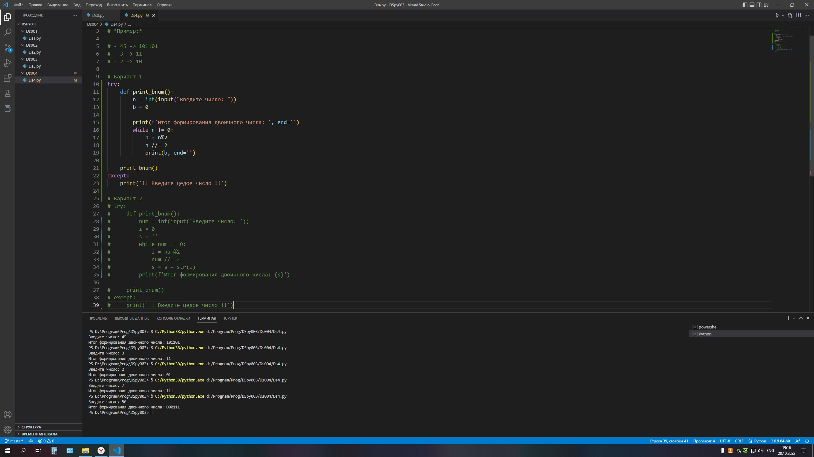
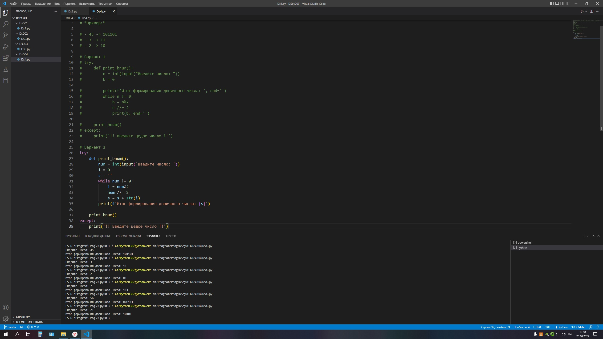

### Задача 4. Напишите программу, которая будет преобразовывать десятичное число в двоичное. Нельзя использовать готовые функции.

### *Пример:*

### - 45 -> 101101
### - 3 -> 11
### - 2 -> 10

### Вариант 1

### Вариант 2
